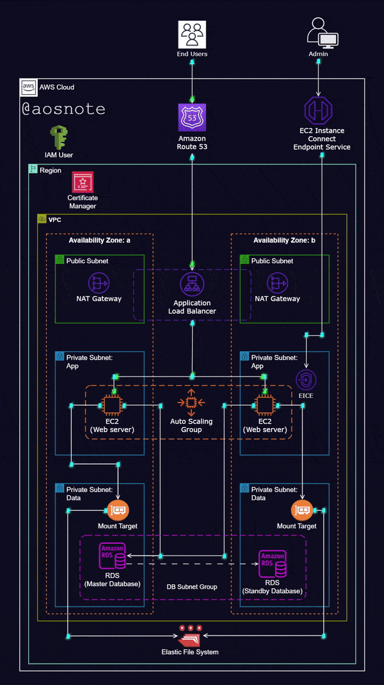

# Host a WordPress Website on AWS
In this project, you'll learn how to host a WordPress website on AWS, using a hands-on approach. We'll cover essential AWS services, including VPC setup with public and private subnets, security groups, EC2 instances, NAT gateways, RDS, EFS, and Application Load Balancers. You'll also explore Route 53, Certificate Manager, and Auto Scaling groups. This practical experience is perfect for beginners, providing a foundational understanding of AWS website hosting.

# Reference Architecture:

# Course Curriculum:
- Build a Three-Tier AWS Network VPC from Scratch
- Create Nat Gateways
- Create the Security Groups
- Create the RDS Instance
- Create the Elastic File System (EFS)
- Install WordPress
- Create an Application Load Balancer
- Register a New Domain Name in Route 53
- Create a Record Set in Route 53
- Register for an SSL Certificate in AWS Certificate Manager
- SSH into Instance in the Private Subnet
- Create an HTTPS Listener for the Application Load Balancer
- Create an Auto Scaling Group
- Install WordPress Theme and Template